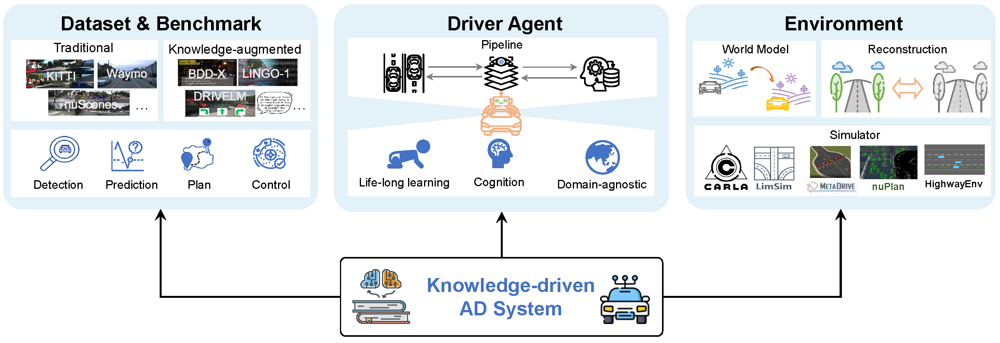

# Awesome Knowledge-driven Autonomous Driving :blue_car: 

[](https://github.com/PJLab-ADG/awesome-knowledge-driven-AD)
[](https://arxiv.org/abs/2312.04316)

<!--


[](https://github.com/PJLab-ADG/awesome-knowledge-driven-AD/blob/main/LICENSE)
[](https://github.com/PJLab-ADG/awesome-knowledge-driven-AD) -->

Here is a collection of research papers and the relevant valuable open-source resources for **awesome knowledge-driven autonomous driving (AD)**. The repository will be continuously updated to track the frontier of knowledge-driven AD.

🌟 Welcome to star and contribute to (PR) this awesome knowledge-driven AD! 🌟

<pre name="code" class="html">
<font color="red">[2023.12.08] <b>New: We release the survey 'Towards Knowledge-driven Autonomous Driving'! </b></font>
<font color="red">[2023.10.24] New: We release the awesome knowledge-driven AD! </font>
</pre>


## :page_with_curl: Outline
  - :art: [Overview of knowledge-driven AD](#art-overview-of-knowledge-driven-ad)
  - :books: [Papers](#books-papers)
    - [Dataset \& Benchmark](#dataset--benchmark)
    - [Environment](#environment)
    - [Driver Agent](#driver-agent)
  - :clipboard: [Survey](#clipboard-survey)
  - :mortar\_board: [Tutorial](#mortar_board-tutorial)
  - :bookmark: [Citation](#bookmark-citation)
  - :memo: [License](#memo-license)

## :art: Overview of knowledge-driven AD
The autonomous driving community has witnessed substantial growth in approaches that embrace a knowledge-driven paradigm. Here, we delve into knowledge-driven autonomous driving, exploring motivations, components, challenges, and prospects. More details of knowledge-driven autonomous driving can be found in our paper.

<p align="center">
    
    <br>
    <em style="display: inline-block;">Key components in knowledge-driven AD.</em>
</p>

## :books: Papers
### Dataset \& Benchmark
| Knowledge-aug. Dataset                        | Sensors  | Knowledge Form                          | Tasks                                      | Metrics                                |
|-------------------------------------------------------------------------|----------|-----------------------------------------|------------------------------|----------------------------------------|
| [BDD-X](https://github.com/JinkyuKimUCB/explainable-deep-driving)              | C        | Explanation                            | Vehicle Control, Explanation Generation, Scene Captioning | MAE, MDC, BLEU-4, METEOR, CIDEr-D      |
| [Cityscapes-Ref](https://arxiv.org/abs/1801.01582) | C     | Object Referral, Gaze Heatmap          | Object Referring                           | Acc@1                                  |
| [DR(eye)VE](http://imagelab.ing.unimore.it/dreyeve)         | C        | Gaze Heatmap                            | Gaze Prediction                            | CC, KLD, IG                            |
| [HAD](https://usa.honda-ri.com/HAD)                  | C        | Advice                                  | Vehicle Control                            | MAE, MDC                              |
| [Talk2Car](https://macchina-ai.cs.kuleuven.be/) | C+L+R | Object Referral                         | Object Referring                           | IoU@0.5                               |
| [DADA-2000](https://github.com/JWFangit/LOTVS-DADA)        | C        | Gaze Heatmap, Crash Objects, Accident Window | Gaze Prediction                            | CC, KLD, NSS, SIM                      |
| [HDBD](https://usa.honda-ri.com/hdbd)            | C        | Gaze Heatmap, Takeover Intention        | Driver Takeover Detection                  | AUC                                    |
| [Refer-KITTI](https://github.com/wudongming97/RMOT)   | C+L      | Object Referral                         | Object Referring, Object Tracking           | HOTA                                   |
| [DRAMA](https://usa.honda-ri.com/drama)                | C        | Advice, Risk Localization              | Motion Planning                            | L2 Error, Collision Rate               |
| [Rank2Tell](https://usa.honda-ri.com/rank2tell) | C+L | Object Referral, Importance Ranking    | Importance Estimation, Scene Captioning    | F1 Score, Accuracy, BLEU-4, METEOR, ROUGE, CIDER |
| [DriveLM](https://github.com/OpenDriveLab/DriveLM)          | C   | Scene Captioning, Question Answering    | Scene Captioning, Question Answering, Vehicle Control         | ADE, FDE,  Accuracy,  Collision Rate, SPICE, GPT-Score                                   |
| [NuScenes-QA](https://github.com/qiantianwen/NuScenes-QA)   | C+L+R    | Question Answering                     | Question Answering                         | Exist, Count, Object, Status, Comparison, Acc |
| [DESIGN](https://openreview.net/attachment?id=8T7m27VC3S&name=pdf) | C+L+R | Scene Captioning, Question Answering  | Question Answering, Motion Planning          | BLEU-4, METEOR, ROUGE, L2 Error, Collision Rate  |
| [Reason2Drive](https://github.com/fudan-zvg/Reason2Drive)| C+L   |  Question Answering |  Question Answering      |  BLEU-4, METEOR, ROUGE, CIDER|
| [NuScenes-MQA](https://github.com/fudan-zvg/Reason2Drive)| C+L+R  |  Question Answering |  Question Answering      |  BLEU-4, METEOR, ROUGE|
| [LangAuto](https://github.com/opendilab/LMDrive)| C+L   |  Navigation Instructions, Notice Instructions     | Vehicle Control   |    RC, IS, DS  |
| [DriveMLM](https://github.com/OpenGVLab/DriveMLM) | C+L   | Question Answering, User Instructions    | Vehicle Control, Decision Explanation   |    RC, IS, DS, BLEU-4, METEOR, CIDER|
| [NuInstruct](https://github.com/xmed-lab/NuInstruct) | C  | Scene-, Frame-, Ego-, Instance Information, Question Answering   | Question Answering, Scene Captioning  |    MAE, Accuracy, BLEU-4, mAP |


### Environment
- [UniSim: A Neural Closed-Loop Sensor Simulator](https://openaccess.thecvf.com/content/CVPR2023/papers/Yang_UniSim_A_Neural_Closed-Loop_Sensor_Simulator_CVPR_2023_paper.pdf)[`CVPR 2023`, [Project](https://waabi.ai/unisim/)]
- [NuPlan: A closed-loop ML-based planning benchmark for autonomous vehicles](https://arxiv.org/abs/2106.11810)[`arxiv 2023`, [Github](https://github.com/motional/nuplan-devkit)]
- [DrivingDiffusion: Layout-Guided multi-view driving scene video generation with latent diffusion model](https://arxiv.org/pdf/2310.07771.pdf) [`arxiv 2023`, [Project](https://drivingdiffusion.github.io/)]
- [OccWorld: Learning a 3D Occupancy World Model for Autonomous Driving](https://arxiv.org/abs/2311.16038) [`arxiv 2023`, [Project](https://github.com/wzzheng/OccWorld)]
- [ADriver-I: A General World Model for Autonomous Driving](https://arxiv.org/pdf/2311.13549.pdf) [`arxiv 2023`]
- [Driving into the Future: Multiview Visual Forecasting and Planning with World Model for Autonomous Driving](https://arxiv.org/abs/2311.17918) [`arxiv 2023`, [Project](https://drive-wm.github.io/), [Github](https://github.com/BraveGroup/Drive-WM)]
- [WoVoGen: World Volume-aware Diffusion for Controllable Multi-camera Driving Scene Generation](https://arxiv.org/pdf/2312.02934.pdf) [`arxiv 2023`, [Github](https://github.com/fudan-zvg/WoVoGen)]
- [DriveDreamer: Towards Real-world-driven World Models for Autonomous Driving](https://arxiv.org/pdf/2309.09777.pdf) [`arxiv 2023`]
- [MagicDrive: Street View Generation with Diverse 3D Geometry Control](https://arxiv.org/pdf/2310.02601.pdf) [`arxiv 2023`]
- [GAIA-1: A Generative World Model for Autonomous Driving](https://arxiv.org/abs/2309.17080.pdf) [`arxiv 2023`]
- [Waymax: An Accelerated, Data-Driven Simulator for Large-Scale Autonomous Driving Research](https://arxiv.org/abs/2310.08710) [`NeurIPS 2023`, [Github](https://github.com/waymo-research/waymax)]
- [MUVO: A Multimodal Generative World Model for Autonomous Driving with Geometric Representations](https://arxiv.org/pdf/2311.11762.pdf) [`arxiv 2023`]
- [Natural-language-driven Simulation Benchmark and Copilot for Efficient Production of Object Interactions in Virtual Road Scenes](https://arxiv.org/pdf/2312.04008.pdf) [`arxiv 2023`]
- [LaMPilot: An Open Benchmark Dataset for Autonomous Driving with Language Model Programs](https://arxiv.org/pdf/2312.04372.pdf) [`arxiv 2023`]
- [DrivingGaussian: Composite Gaussian Splatting for Surrounding Dynamic Autonomous Driving Scenes](https://arxiv.org/abs/2312.07920) [`arxiv 2023`]
- [OccNeRF: Self-Supervised Multi-Camera Occupancy Prediction with Neural Radiance Fields](https://arxiv.org/abs/2312.09243) [`arxiv 2023`]
- ChatSim: Editable Scene Simulation for Autonomous Driving via LLM-Agent Collaboration [`coming soon`, [Github](https://github.com/yifanlu0227/ChatSim), [Project](https://yifanlu0227.github.io/ChatSim/)]
- [Neural Lighting Simulation for Urban Scenes](https://arxiv.org/abs/2312.06654) [`NeurIPS 2023`, [Project](https://waabi.ai/lightsim/)]
- [Street Gaussians for Modeling Dynamic Urban Scenes](https://arxiv.org/abs/2401.01339) [`arxiv 2023`, [Github](https://github.com/zju3dv/street_gaussians), [Project](https://zju3dv.github.io/street_gaussians/)]

### Driver Agent
- [Grounding human-to-vehicle advice for self-driving vehicles](https://openaccess.thecvf.com/content_CVPR_2019/papers/Kim_Grounding_Human-To-Vehicle_Advice_for_Self-Driving_Vehicles_CVPR_2019_paper.pdf) [`CVPR 2019`]
- [ADAPT: Action-aware Driving Caption Transformer](https://arxiv.org/abs/2302.00673.pdf) [`ICRA 2023`, [Github](https://github.com/jxbbb/ADAPT)]
- [Talk to the Vehicle: Language Conditioned Autonomous Navigation of Self Driving Cars](http://cdn.iiit.ac.in/cdn/cvit.iiit.ac.in/images/ConferencePapers/2019/Talk-to-the-Vehicle-IROS_2019.pdf)  [`IROS 2019`]
- [Talk2Car: Taking Control of Your Self-Driving Car](https://arxiv.org/abs/1909.10838.pdf) [`EMNLP-IJNLP 2019`, [Project](https://macchina-ai.cs.kuleuven.be/)]
- [Textual explanations for self-driving vehicles](http://openaccess.thecvf.com/content_ECCV_2018/papers/Jinkyu_Kim_Textual_Explanations_for_ECCV_2018_paper.pdf) [`ECCV 2018`, [Github](https://github.com/JinkyuKimUCB/explainable-deep-driving)]
- [Drive Like a Human: Rethinking Autonomous Driving with Large Language Models](https://arxiv.org/abs/2307.07162) [`arxiv 2023`, [Github](https://github.com/PJLab-ADG/DriveLikeAHuman)]
- [DriveGPT4: Interpretable End-to-end Autonomous Driving via Large Language Model](https://arxiv.org/abs/2310.01412)] [`arxiv 2023`, [Project](https://tonyxuqaq.github.io/projects/DriveGPT4/)]
- [DiLu: A Knowledge-Driven Approach to Autonomous Driving with Large Language Models](https://arxiv.org/pdf/2309.16292.pdf) [`arxiv 2023`, [Github](https://github.com/PJLab-ADG/DiLu)]
- [GPT-Driver: Learning to Drive with GPT](https://arxiv.org/abs/2310.01415) [`arxiv 2023`, [Github](https://github.com/PointsCoder/GPT-Driver)]
- [Driving with LLMs: Fusing Object-Level Vector Modality for Explainable Autonomous Driving](https://arxiv.org/abs/2310.01957) [`arxiv 2023`, [Github](https://github.com/wayveai/Driving-with-LLMs)]
- [LanguageMPC: Large Language Models as Decision Makers for Autonomous Driving](https://arxiv.org/abs/2310.03026) [`arxiv 2023`, [Project](https://sites.google.com/view/llm-mpc)]
- [Receive, Reason, and React: Drive as You Say with Large Language Models in Autonomous Vehicles](https://arxiv.org/abs/2310.08034) [`arxiv 2023`]
- [Drive as You Speak: Enabling Human-Like Interaction with Large Language Models in Autonomous Vehicles](https://arxiv.org/abs/2309.10228) [`arxiv 2023`]
- [SurrealDriver: Designing Generative Driver Agent Simulation Framework in Urban Contexts based on Large Language Model](https://arxiv.org/abs/2309.13193) [`arxiv 2023`]
- [Language-Guided Traffic Simulation via Scene-Level Diffusion](https://arxiv.org/abs/2306.06344) [`arxiv 2023`]
- [Language Prompt for Autonomous Driving](https://arxiv.org/abs/2309.04379v1) [`arxiv 2023`, [Github](https://github.com/wudongming97/Prompt4Driving)]
- [Talk2BEV: Language-Enhanced Bird's Eye View (BEV) Maps](https://arxiv.org/abs/2310.02251) [`arxiv 2023`, [Project](https://llmbev.github.io/talk2bev/), [Github](https://github.com/llmbev/talk2bev)]
- [BEVGPT: Generative Pre-trained Large Model for Autonomous Driving Prediction, Decision-Making, and Planning](https://arxiv.org/abs/2310.10357) [`AAAI 2024`]
- [HiLM-D: Towards High-Resolution Understanding in Multimodal Large Language Models for Autonomous Driving](https://arxiv.org/pdf/2309.05186.pdf) [`arxiv 2023`]
- [Can you text what is happening? Integrating pre-trained language encoders into trajectory prediction models for autonomous driving](https://arxiv.org/pdf/2309.05282.pdf) [`arxiv 2023`]
- [OpenAnnotate3D: Open-Vocabulary Auto-Labeling System for Multi-modal 3D Data](https://arxiv.org/pdf/2310.13398.pdf) [`arxiv 2023`, [Github](https://github.com/Fudan-ProjectTitan/OpenAnnotate3D)]
- [LangProp: A Code Optimization Framework Using Language Models Applied to Driving](https://openreview.net/pdf?id=UgTrngiN16) [`openreview 2023`, [Github](https://github.com/langprop-iclr24/LangProp)]
- [Learning Unsupervised World Models for Autonomous Driving via Discrete Diffusion](https://openreview.net/pdf?id=Psl75UCoZM) [`openreview 2023`]
- [Planning with an Ensemble of World Models](https://openreview.net/pdf?id=cvGdPXaydP) [`openreview 2023`]
- [Large Language Models Can Design Game-Theoretic Objectives for Multi-Agent Planning](https://openreview.net/pdf?id=DnkCvB8iXR) [`openreview 2023`]
- [TrafficBots: Towards World Models for Autonomous Driving Simulation and Motion Prediction](https://arxiv.org/pdf/2303.04116.pdf) [`arxiv 2023`]
- [BEV-CLIP: Multi-Modal BEV Retrieval Methodology for Complex Scene in Autonomous Driving](https://openreview.net/pdf?id=wlqkRFRkYc) [`arxiv 2023`]
- [Large Language Models Can Design Game-theoretic Objectives for Multi-Agent Planning](https://openreview.net/attachment?id=DnkCvB8iXR&name=pdf) [`openreview 2023`]
- [Semantic Anomaly Detection with Large Language Models](https://arxiv.org/pdf/2305.11307.pdf) [`arxiv 2023`]
- [Driving through the Concept Gridlock: Unraveling Explainability Bottlenecks in Automated Driving](https://arxiv.org/pdf/2310.16639.pdf) [`arxiv 2023`]
- [Drama: Joint risk localization and captioning in driving](https://openaccess.thecvf.com/content/WACV2023/papers/Malla_DRAMA_Joint_Risk_Localization_and_Captioning_in_Driving_WACV_2023_paper.pdf) [`WACV 2023`]
- [3D Dense Captioning Beyond Nouns: A Middleware for Autonomous Driving](https://openreview.net/attachment?id=8T7m27VC3S&name=pdf) [`openreview 2023`]
- [SwapTransformer: Highway Overtaking Tactical Planner Model via Imitation Learning on OSHA Dataset](https://openreview.net/attachment?id=9wSWiavGwU&name=pdf) [`openreview 2023`]
- [NuScenes-QA: A Multi-modal Visual Question Answering Benchmark for Autonomous Driving Scenario](https://arxiv.org/pdf/2305.14836.pdf) [`arxiv 2023`, [Github](https://github.com/qiantianwen/NuScenes-QA)]
- [Language Prompt for Autonomous Driving](https://arxiv.org/abs/2309.04379v1) [`arxiv 2023`, [Github](https://github.com/wudongming97/Prompt4Driving)]
- [Drive Anywhere: Generalizable End-to-end Autonomous Driving with Multi-modal Foundation Models](https://arxiv.org/abs/2310.17642) [`arxiv 2023`]
- [Addressing Limitations of State-Aware Imitation Learning for Autonomous Driving](https://arxiv.org/pdf/2310.20650.pdf) [`arxiv 2023`]
- [A Language Agent for Autonomous Driving](https://arxiv.org/pdf/2311.10813) [`arxiv 2023`]

- [Human-Centric Autonomous Systems With LLMs for User Command Reasoning](https://arxiv.org/pdf/2311.08206.pdf) [`WACVW 2024`]
- [On the Road with GPT-4V (ision): Early Explorations of Visual-Language Model on Autonomous Driving](https://arxiv.org/pdf/2311.05332) [`arxiv 2023`]
- [Reason2Drive: Towards Interpretable and Chain-based Reasoning for Autonomous Driving](https://arxiv.org/pdf/2312.03661.pdf) [`arxiv 2023`, [Github](https://github.com/fudan-zvg/Reason2Drive)]
- [GPT-4 Enhanced Multimodal Grounding for Autonomous Driving: Leveraging Cross-Modal Attention with Large Language Models](https://arxiv.org/pdf/2312.03543.pdf) [`arxiv 2023`, [Github](https://github.com/Petrichor625/Talk2car_CAVG)]
- [ChatGPT as Your Vehicle Co-Pilot: An Initial Attempt](https://ieeexplore.ieee.org/document/10286969) [`IEEE TIV 2023`]
- [DriveLLM: Charting The Path Toward Full Autonomous Driving with Large Language Models](https://ieeexplore.ieee.org/document/10297415/) [`IEEE TIV 2023`]
- [NuScenes-MQA: Integrated Evaluation of Captions and QA for Autonomous Driving Datasets using Markup Annotations](https://arxiv.org/pdf/2312.06352.pdf) [`WACVW 2024`, [Github](https://github.com/turingmotors/NuScenes-MQA)]
- [Evaluation of Large Language Models for Decision Making in Autonomous Driving](https://arxiv.org/pdf/2312.06351.pdf) [`arxiv 2023`]
- [LMDrive: Closed-Loop End-to-End Driving with Large Language Models](https://arxiv.org/pdf/2312.07488.pdf) [`arxiv 2023`, [Github](https://github.com/opendilab/LMDrive)]
- [DriveMLM: Aligning Multi-Modal Large Language Models with Behavioral Planning States for Autonomous Driving](https://arxiv.org/abs/2312.09245) [`arxiv 2023`, [Github](https://github.com/OpenGVLab/DriveMLM)]
- [Large Language Models for Autonomous Driving: Real-World Experiments](https://arxiv.org/pdf/2312.09397.pdf) [`arxiv 2023`]
- [LingoQA: Video Question Answering for Autonomous Driving](https://arxiv.org/pdf/2312.14115.pdf) [`arxiv 2023`, [Github](https://github.com/wayveai/LingoQA)]
- [DriveLM: Driving with Graph Visual Question Answering](https://arxiv.org/pdf/2312.14150.pdf) [`arxiv 2023`, [Github](https://github.com/OpenDriveLab/DriveLM)]
- [LLM-Assist: Enhancing Closed-Loop Planning with Language-Based Reasoning](https://arxiv.org/abs/2401.00125) [`arxiv 2023`, [Project](https://llmassist.github.io/)]
- [Holistic Autonomous Driving Understanding by Bird’s-Eye-View Injected Multi-Modal Large Models](https://arxiv.org/pdf/2401.00988.pdf) [`arxiv 2023`, [Github](https://github.com/xmed-lab/NuInstruct)]
- [BEV-CLIP: Multi-modal BEV Retrieval Methodology for Complex Scene in Autonomous Driving](https://arxiv.org/abs/2401.01065) [`arxiv 2023`]


## :clipboard: Survey
- [Applications of Large Scale Foundation Models for Autonomous Driving](https://arxiv.org/abs/2311.12144) [`arxiv 2023`]
- [A Survey on Multimodal Large Language Models for Autonomous Driving](https://arxiv.org/pdf/2311.12320) [`arxiv 2023`]
- [A Survey of Large Language Models for Autonomous Driving](https://arxiv.org/abs/2311.01043) [`arxiv 2023`]
- [Vision Language Models in Autonomous Driving and Intelligent Transportation Systems](https://arxiv.org/abs/2310.14414) [`arxiv 2023`]
- [A Survey of Simulators for Autonomous Driving: Taxonomy, Challenges, and Evaluation Metric](https://arxiv.org/pdf/2311.11056.pdf) [`arxiv 2023`]
- [Towards Knowledge-driven Autonomous Driving](https://arxiv.org/abs/2312.04316) [`arxiv 2023`]

## :mortar_board: Tutorial
- [WACV2024 Workshop] [MAPLM: A Large-Scale Vision-Language Dataset for Map and Traffic Scene Understanding](https://llvm-ad.github.io/)
- [Blog] [LINGO-1: Exploring Natural Language for Autonomous Driving](https://wayve.ai/thinking/lingo-natural-language-autonomous-driving/)
- [Blog] [Introducing GAIA-1: A Cutting-Edge Generative AI Model for Autonomy](https://wayve.ai/thinking/introducing-gaia1/)
- [Blog] [Ghost Gym: A Neural Simulator for Autonomous Driving](https://wayve.ai/thinking/ghost-gym-neural-simulator/)

## :bookmark: Citation
If you find our paper useful, please kindly cite us via:
```
@article{li2023knowledgedriven,
  title={Towards Knowledge-driven Autonomous Driving},
  author={Li, Xin and Bai, Yeqi and Cai, Pinlong and Wen, Licheng and Fu, Daocheng and Zhang, Bo and Yang, Xuemeng and Cai, Xinyu and Ma, Tao and Guo, Jianfei and Gao, Xing and Dou, Min and Shi, Botian and Liu, Yong and He, Liang and Qiao, Yu},
  journal={arXiv preprint arXiv:2312.04316},
  year = {2023}
}
```

## :memo: License

Awesome Knowledge-driven Autonomous Driving is released under the Apache 2.0 license.
